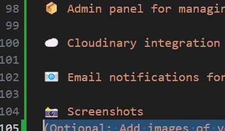

Website Link:
https://ecom-ff.vercel.app/

Admin Link:
https://ecom-aa.vercel.app/


# 👗 Women’s Clothing E-Commerce Web App

This is a full-stack E-Commerce application tailored for women’s fashion. Users can browse collections by category, add items to cart, and make purchases through secure Stripe payment integration. An admin panel is also included to manage products, orders, and users.

---

## 🛠️ Tech Stack

- **Frontend:** Vite + React
- **Backend:** Node.js, Express.js, MongoDB
- **Admin Panel:** Vite + React
- **Cloud:** Cloudinary for image uploads
- **Payments:** Stripe
- **Emailing:** Nodemailer

---

## 🚀 How to Run Locally

### 1️⃣ Clone the Repository

```bash
git clone https://github.com/ShraddhaS007/ecom.git
cd ecom

2️⃣ Install Dependencies
Install dependencies in all three folders:

cd backend
npm install

cd ../frontend
npm install

cd ../admin
npm install

3️⃣ Setup Environment Variables
Create a .env file in each folder as follows:

🔒 backend/.env

MONGODB_URI="your_mongodb_connection_string"
CLOUDINARY_API_KEY="your_cloudinary_api_key"
CLOUDINARY_SECRET_KEY="your_cloudinary_secret_key"
CLOUDINARY_NAME="your_cloudinary_name"
JWT_SECRET="your_jwt_secret"
ADMIN_EMAIL="admin@example.com"
ADMIN_PASSWORD="your_admin_password"
EMAIL_USER="your_email@example.com"
EMAIL_PASS="your_email_password"
STRIPE_SECRET_KEY="your_stripe_secret_key"

⚠️ Replace placeholder values with your actual secrets.

🌐 frontend/.env

VITE_BACKEND_URL=http://localhost:5000


🌐 admin/.env

VITE_BACKEND_URL=http://localhost:5000


🔃 Run the Project

▶️ Start the Backend

cd backend
nodemon server.js

▶️ Start the Frontend (User Interface)

cd frontend
npm run dev

▶️ Start the Admin Panel

cd admin
npm run dev

🎯 Features--

👗 Browse women's clothing by categories (tops, bottoms, accessories, etc.)

🛒 Add items to cart and checkout securely using Stripe

🔐 User authentication and session handling

📦 Admin panel for managing: Products, Orders and Users

☁️ Cloudinary integration for image uploads

📧 Email notifications for order confirmations and more

📸 Screenshots


🙋‍♀️ Author
Shraddha Srivastava
http://github.com/ShraddhaS007